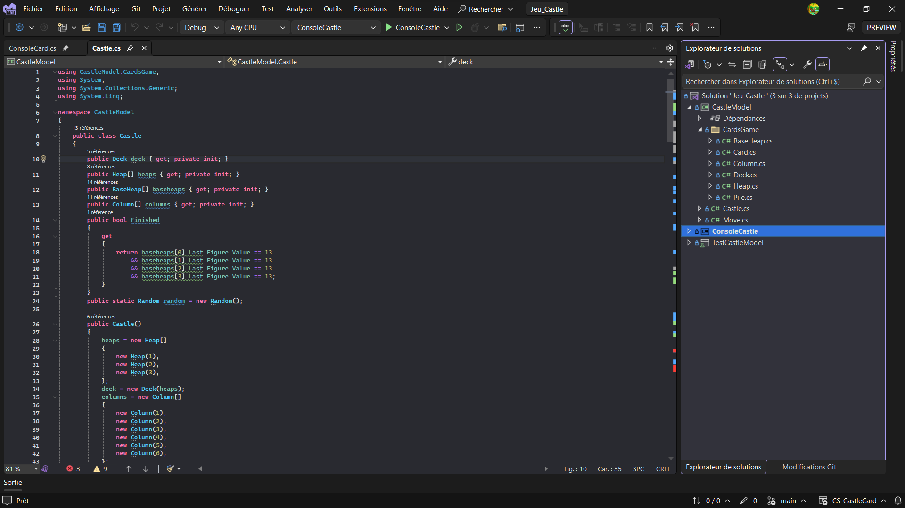
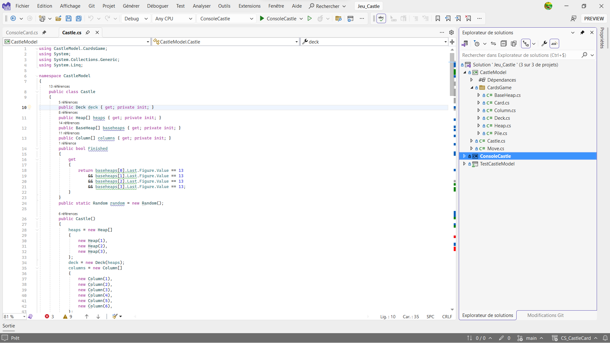

# XcodeThemeForVS

Bring the color of the following Xcode themes to Visual Studio ([Adapted version of Mateo Cerquetella's VSCode theme.](https://github.com/MateoCerquetella/xcode-theme/)):

- Xcode Classic (Dark)
- Xcode Classic (Light)

Matches the default window and syntax colors of Xcode.

The JSON files are derived from the original themes, then converted using [Theme Converter](https://github.com/microsoft/theme-converter-for-vs), and finally built using this VS project.

## Xcode Classic (Dark)

## Xcode Classic (Light)

